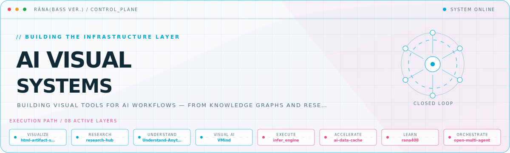
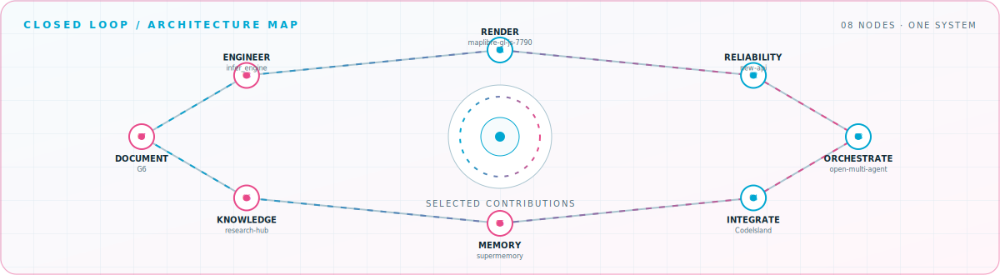

<picture>
  <source media="(prefers-color-scheme: dark)" srcset="assets/hero-dark.svg">
  <source media="(prefers-color-scheme: light)" srcset="assets/hero-light.svg">
  
</picture>

 

Building visual tools for AI workflows — from knowledge graphs and research workspaces to C\+\+ inference engines\.

## Flagship systems

| Repository | Role | Purpose |
| --- | --- | --- |
| [`html-artifact-skill`](https://github.com/cat0825/html-artifact-skill)  | VISUALIZE | A Craft Agent skill for generating polished, interactive HTML artifacts\. |
| [`research-hub`](https://github.com/cat0825/research-hub)  | RESEARCH | A Next\.js and Supabase workspace for publishing and browsing research resources\. |
| [`Understand-Anything`](https://github.com/cat0825/Understand-Anything)  | UNDERSTAND | Interactive knowledge graphs for codebases, knowledge bases, and documentation\. |
| [`infer_engine`](https://github.com/cat0825/infer_engine)  | EXECUTE | A minimal-dependency C\+\+17 inference engine with DAG-based operator scheduling\. |
| [`ai-data-cache`](https://github.com/cat0825/ai-data-cache)  | ACCELERATE | High-performance dataset caching for AI training with zero-copy data paths\. |
| [`rana408`](https://github.com/cat0825/rana408)  | LEARN | A structured 408 computer-science knowledge base built around probing questions\. |

## Closed-loop architecture

<picture>
  <source media="(prefers-color-scheme: dark)" srcset="assets/closed-loop-dark.svg">
  <source media="(prefers-color-scheme: light)" srcset="assets/closed-loop-light.svg">
  
</picture>

## Module registry

<strong>Visual systems</strong> · 3 modules

| Module | Purpose |
| --- | --- |
| [`html-artifact-skill`](https://github.com/cat0825/html-artifact-skill) | Magazine-grade HTML artifacts with themes, diagrams, and motion\. |
| [`VMind`](https://github.com/cat0825/VMind) | Intelligent data visualization based on LLMs\. |
| [`G6`](https://github.com/cat0825/G6) | A graph visualization framework in JavaScript\. |

<strong>Knowledge systems</strong> · 3 modules

| Module | Purpose |
| --- | --- |
| [`Understand-Anything`](https://github.com/cat0825/Understand-Anything) | Interactive knowledge graphs for codebases and docs\. |
| [`research-hub`](https://github.com/cat0825/research-hub) | Publish and browse research resources with a Next\.js and Supabase app\. |
| [`rana408`](https://github.com/cat0825/rana408) | A 408 computer-science knowledge base for structured learning\. |

<strong>AI systems</strong> · 3 modules

| Module | Purpose |
| --- | --- |
| [`infer_engine`](https://github.com/cat0825/infer_engine) | Lightweight C\+\+ inference with graph execution and SIMD optimization\. |
| [`ai-data-cache`](https://github.com/cat0825/ai-data-cache) | Zero-copy, lock-free dataset caching for AI training\. |
| [`ds4`](https://github.com/cat0825/ds4) | Local inference engine work targeting Metal and CUDA\. |

<strong>Agent workflows</strong> · 3 modules

| Module | Purpose |
| --- | --- |
| [`open-multi-agent`](https://github.com/cat0825/open-multi-agent) | Multi-agent orchestration from goals to task DAGs\. |
| [`pi`](https://github.com/cat0825/pi) | AI agent toolkit with a coding-agent CLI and unified model API\. |
| [`taste-skill`](https://github.com/cat0825/taste-skill) | A skill focused on improving the visual quality of AI-generated work\. |

<a href="https://github.com/cat0825">GitHub</a>

<!-- Generated by profile-control-plane. Edit profile.yaml, not this file. -->
